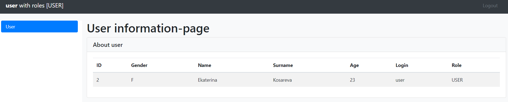
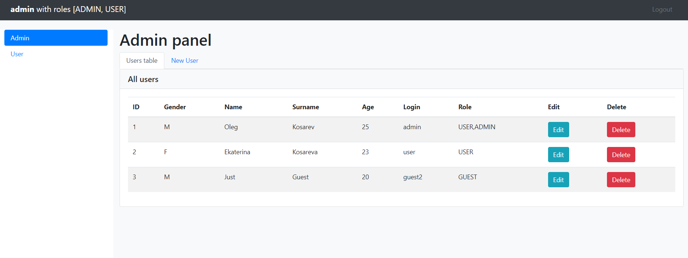
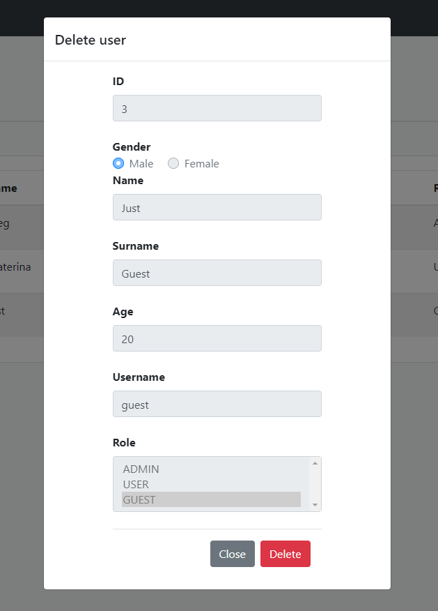

- [Задание](#Задание)
- [Скриншоты](#Скриншоты)

# Задание

1. Написать Rest-контроллеры для вашего приложения.
2. Переписать вывод (заполнение) таблицы, модальных окон и т.д. на JS c помощью Fetch API, допускается использование JQuery.
3. При любых изменениях данных страница приложения не должна перезагружаться!

# Скриншоты

```
Login page
```

```
User page
```

```
Admin page
```

```
Add new user
```

```
Edit user
```

```
Delete user
```
